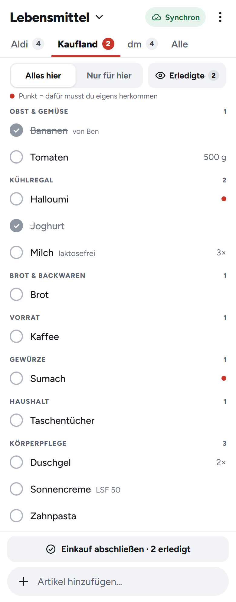
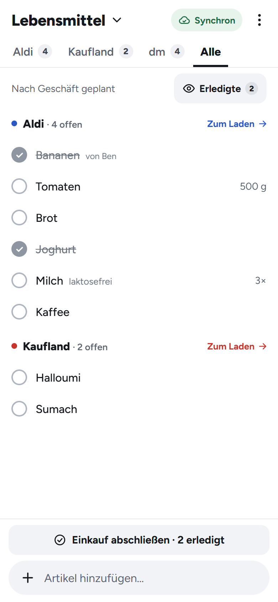
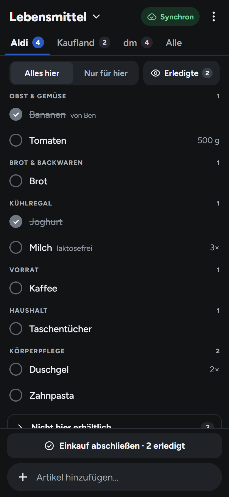

# Familien-Einkaufsliste

Eine geteilte Einkaufsliste für die Familie. Sie läuft als PWA auf dem Handy, funktioniert im Laden auch ohne Netz und sortiert sich nach dem Laufweg des jeweiligen Geschäfts.

<p align="center">
  
  
  
</p>

## Die Idee

Viele Einkaufslisten-Apps führen eine Liste pro Geschäft. Dann muss man bei jedem Eintrag entscheiden, wo man ihn kauft, und Artikel landen in der falschen Liste. Diese App dreht das um:

- **Verfügbarkeit statt Store-Listen:** Ein Artikel ist irgendwo *erhältlich*, z. B. Milch bei Aldi und Kaufland. Das pflegt man einmal, danach gilt es für jeden Einkauf.
- **Geschäfte sind Ansichten:** Jedes Geschäft zeigt, was man dort kaufen kann, sortiert nach dem eigenen **Laufweg**. Im Laden spielt die Liste keine Rolle: Lebensmittel und Drogerie-Artikel stehen in einem Durchgang.
- **„Alles hier“ oder „Nur für hier“:** entweder alles, was es dort gibt, oder nur das, wofür man eigens in dieses Geschäft muss. Ein Punkt in der Farbe des Geschäfts markiert genau diese Einträge, die Badges an den Tabs zählen sie.
- **Stabile Sortierung:** Abhaken ändert nie die Position. Innerhalb einer Warengruppe lässt sich die Reihenfolge pro Geschäft per Drag & Drop festlegen.

## Funktionen

- **Offline zuerst:** Die Daten liegen in IndexedDB, alle Aktionen funktionieren ohne Netz und werden später abgeglichen. Dabei gibt es keine Duplikate und es geht nichts verloren.
- **Sync in der Familie:** eigenes schlankes Protokoll (Last-Writer-Wins pro Feld, Outbox, Background Sync). Beitritt per Einladungslink, kein Konto und kein Passwort nötig.
- **Schnelles Hinzufügen:** Autocomplete aus dem Verlauf, Mengen werden aus der Eingabe gelesen („2 Milch“, „Tomaten 500g“).
- **Einkaufsmodus:** Das Display bleibt an, die Zeilen sind größer, abgeglichen wird häufiger.
- **Mehrere Listen, Geschäfte und Warengruppen**, alles in der App verwaltbar. Dazu Laufweg-Editor, Hell/Dunkel, Export/Import als JSON (auch als Import aus anderen Apps per Text).
- **Mehrere Haushalte** pro Installation, strikt getrennt.

Die Oberfläche ist auf Deutsch.

## Technik

| Teil | Stack |
|---|---|
| Frontend (`app/`) | React 19, TypeScript, Vite, `vite-plugin-pwa` (Workbox), Dexie, `@dnd-kit` |
| Backend (`server/`) | Deno 2, Hono, SQLite (`node:sqlite`) lokal bzw. libSQL auf bunny.net |
| Gemeinsam (`shared/`) | Datenmodell, Ansichtslogik, Seed, Mengen-Parser: reines TypeScript ohne Abhängigkeiten |

Die ausführliche Spezifikation mit Konzept, Datenmodell, Sync-Protokoll und Entscheidungen steht in [SPEC.md](SPEC.md).

## Lokal entwickeln

Voraussetzungen: [Deno 2](https://deno.com) und Node 24.

```bash
deno task dev                 # API auf http://localhost:8787 (SQLite in server/data/)
npm --prefix app install
npm --prefix app run dev      # App auf http://localhost:5180 (Proxy auf die API)
```

Lokal ist kein Einrichtungscode gesetzt. „Neuen Haushalt anlegen“ funktioniert also direkt, und ein Haushalt startet mit Beispiel-Geschäften, -Listen und -Warengruppen.

Tests und Typprüfung:

```bash
deno task test
deno task check
```

## Betrieb

### Auf bunny.net (so ist es gedacht)

Die PWA liegt auf Bunny Sites, die API läuft als Edge Script, die Daten liegen in Bunny Database. Die Skripte in [deploy/](deploy/) (PowerShell 7, laufen auch unter Linux) richten alles über die Bunny CLI ein:

1. `bunny login`, dann Namen und Region in [deploy/config.env](deploy/config.env) prüfen.
2. Eigene Werte wie CLI-Profil oder Domains in `deploy/config.local.env` eintragen (nicht im Repo, überschreibt `config.env`).
3. `./deploy/setup.ps1` legt Datenbank, Edge Script und Site an.
4. `./deploy/deploy.ps1` spielt Migrationen, API und PWA aus. Beim ersten Mal wird ein **Einrichtungscode** erzeugt und in `.env` abgelegt. Nur damit lassen sich neue Haushalte anlegen, alle anderen treten per Einladung bei.
5. Optional eine eigene Domain: `APP_DOMAIN`/`API_DOMAIN` setzen, CNAMEs anlegen, `./deploy/domains.ps1` ausführen.

API-/Web-Deploys wenden anschließend `deploy/security.ps1` an. Das erzwingt HTTPS auf allen
Projekt-Hostnamen, deaktiviert TLS 1.0/1.1 und setzt Sicherheitsheader einschließlich CSP und HSTS.
Die API wird nicht gecacht; der Service Worker wird bei Updates neu validiert.

**Bunny Shield:** Das Skript wählt ausdrücklich **Basic**, aktiviert das allgemeine WAF-Profil im
Blockiermodus und DDoS-Schutz. Es richtet pro IP 5 Beitritts-/Einrichtungsversuche, 100 API-Anfragen
und 300 App-Anfragen pro 10 Sekunden ein (Basic erlaubt keine längeren Zeitfenster). Bei Überschreitung
gilt eine Sperre für 30 Sekunden; die App behält ungesendete Änderungen für einen späteren Versuch.
Keine kostenpflichtigen Zusatzmodule oder automatischen
Tarifwechsel. Basic hat keine Grundgebühr und enthält 25 Mio. Requests pro Monat; darüber berechnet
Bunny derzeit $0,70 pro Million ([Tarife](https://bunny.net/shield/)).

```powershell
./deploy/security.ps1 -Check  # Einstellungen nur lesen
./deploy/security.ps1         # Absicherung erneut anwenden
```

Neue Clients teilen Sync-Anfragen einschließlich UTF-8/JSON in Pakete unter 240 KB auf. Damit
liegen sie unter dem 256-KB-Prüflimit von Shield Basic. Für ältere installierte PWAs blockiert
Shield größere Bodies nicht allein wegen dieses Prüflimits; das Backend erzwingt beim Einlesen
weiterhin maximal 512.000 Bytes. Header-/Body-Logging in Shield bleibt ausgeschaltet.

Beim Entfernen eines Geräts werden alle bisherigen Einladungen seines Haushalts ungültig.
Verbleibende Geräte können danach neue Einladungen erstellen. Einmal vergebene Sync-Zeitstempel
werden in `mutation_timestamps` dauerhaft gespeichert, damit auch späte Wiederholungen verlorener
Anfragen keine neueren Änderungen überschreiben.

Details stehen in [SPEC.md, Abschnitt 8](SPEC.md#8-deployment-bunny-cli).

### Selbst gehostet

[server/main.ts](server/main.ts) liefert API und gebaute PWA zusammen aus und nutzt eine SQLite-Datei:

```bash
npm --prefix app run build
SETUP_CODE=mein-geheimer-code DB_PATH=/var/lib/einkauf/einkauf.db PORT=8787 deno run -A server/main.ts
```

Ohne `SETUP_CODE` kann jeder, der den Server erreicht, einen Haushalt anlegen.

## Lizenz

[MIT](LICENSE)
